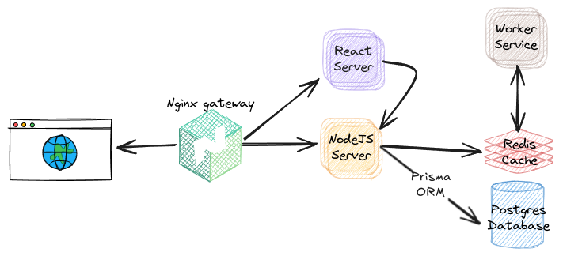

# FibApp - An (overcomplicated) Fibonacci Calculator

**FibApp** is a purposefully overengineered, multi-service application created
to **learn, experiment with, and explore** foundational concepts in modern web
development. 🚀

> Much of the inspiration for this project comes from
> _[Docker and Kubernetes - The Complete Guide](https://www.udemy.com/course/docker-and-kubernetes-the-complete-guide)_
> by Stephen Grider. For those aiming to master _Docker and Kubernetes_, this
> resource is highly recommended.

## 🌐 Application Overview

- **Redis Cache** — an in-memory data structure store, used as a cache and
  message broker.
- **API Service** — Node.js + [Express](https://expressjs.com/) app that stores
  and retrieves Fibonacci numbers from Redis.
- **Worker** — Node.js process that listens on Redis Pub/Sub, computes Fibonacci
  numbers, and caches results in Redis.
- **React Server** — [React](https://react.dev/) application built with
  [vite](https://vite.dev/) and styled with [Pico CSS](https://picocss.com/).

## 📂 Monorepo Setup with Turborepo

The repository is organized as a monorepo using
[Turborepo](https://turborepo.com/) to manage multiple services and projects.

### Key benefits of using Turborepo

- **Efficient Builds:** Caches and optimizes tasks to speed up development.
- **Unified Management:** Centralizes scripts and dependencies for consistent
  tooling.
- **Scalability:** Easily add new services or utilities without complicating the
  setup.

### Apps, Packages and Technologies

- `@repo/eslint-config`: `eslint` configurations (includes
  `eslint-plugin-prettier`)
- `@repo/typescript-config`: `tsconfig.json`s used throughout the monorepo
- `@repo/vitest-config`: `vitest` configurations, for react and node

This Turborepo has some additional tools already setup:

- [Pnpm](https://pnpm.io/) as the package manager
- [TypeScript](https://www.typescriptlang.org/) for static type checking
- [ESLint](https://eslint.org/) & [Prettier](https://prettier.io) for code
  quality

Make sure the following are installed on your machine:

- [Node.js](https://nodejs.org/) — a JS runtime
- [Docker](https://www.docker.com/) — containerization platform

## 🔗 Useful Links

- [Turbo Documentation](https://turbo.build/repo/docs)
- [Turbo API Reference](https://turbo.build/repo/docs/reference)
